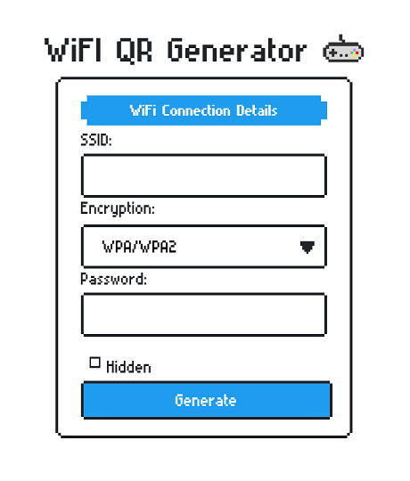

# Wifi-QR-Generator 

Create QR codes for Wi-Fi access points to connect to with ease.\


## Working

Webapp built using Python-Flask to take Wi-Fi connection details to create a QR codes to share. 

## Built Using

* [Python](https://www.python.org/)

## Usage

*Clone this repo.

*Install requirements.
```
pip install -r requirements.txt
```
###### Use virtual environment.

*Run script.
```
python3 <path-to-__init__.py-file>
```

## Author

* **Dhivakar Chelladurai** -  <a href="https://dhivakar.xyz">dhivakar.xyz</a>

## License

This project is licensed under the MIT License - see the [LICENSE](LICENSE) file for details
